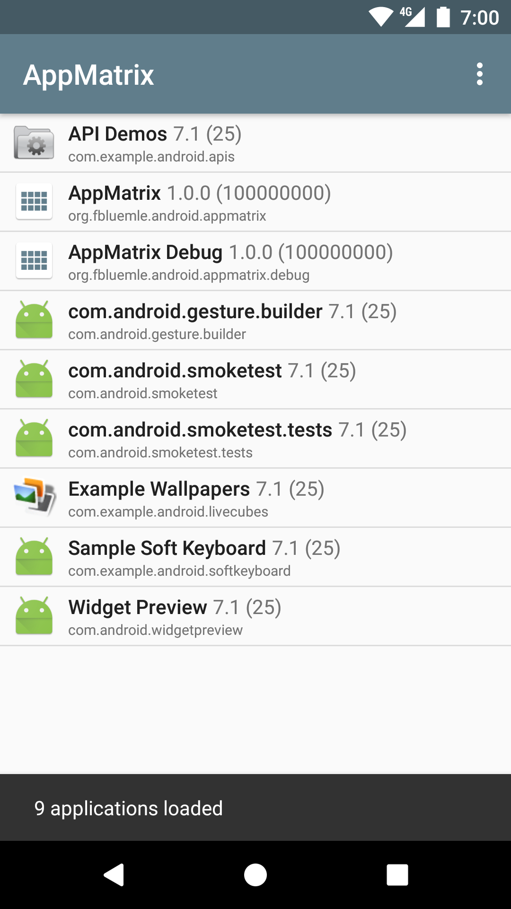
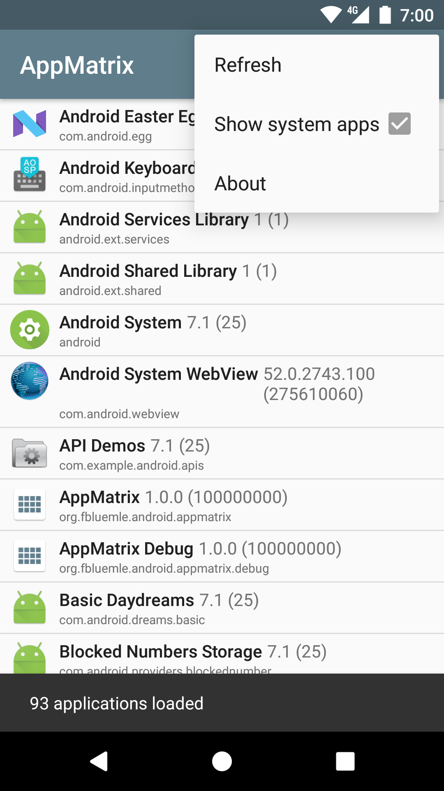

# AppMatrix

### List and manage your installed apps

A simple utility app that lists all your installed apps (optionally including system apps), with detailed version information.

More features will be added soon and contributions are welcome.

This app is free and open source
[https://github.com/friederbluemle/appmatrix](https://github.com/friederbluemle/appmatrix)

## License

    Copyright 2017 Frieder Bluemle

    Licensed under the Apache License, Version 2.0 (the "License");
    you may not use this file except in compliance with the License.
    You may obtain a copy of the License at

        http://www.apache.org/licenses/LICENSE-2.0

    Unless required by applicable law or agreed to in writing, software
    distributed under the License is distributed on an "AS IS" BASIS,
    WITHOUT WARRANTIES OR CONDITIONS OF ANY KIND, either express or implied.
    See the License for the specific language governing permissions and
    limitations under the License.
